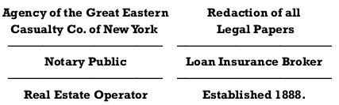

---

date: Fall Term 2022
title: Professional Responsibility

Part: Law as a Regulated Profession

author: Eric M. Fink
publisher: Elon University School of Law

bibliography: '../assets/bibliography/PRCasebook.yaml'
csl: '../assets/bibliography/casebook.csl'
citation-abbreviations: '../assets/bibliography/casebook-abbrevs.json'

output:
  pdf_document:
    template: casebook.tex
    path: ../PDF/Part1.pdf
    pandoc_args: []

---

\chapter{Law as a Regulated Profession}

# Professions and Professionalism

\reading{Work, Jurisdiction, and Competition}{Andrew Abbott{The System of Professions}

Each profession is bound to a set of tasks by ties of jurisdiction, the strengths and weaknesses of these ties being established in the processes of actual professional work. Since none of these links is absolute or permanent, the professions make up an interacting system, an ecology. Professions compete within this system, and a profession's success reflects as much the situations of its competitors and the system structure as it does the professions own efforts. From time to time, tasks are created, abolished, or reshaped by external forces, with consequent jostling and readjustment within the system of professions.

[ … ]

Jurisdiction is a more-or-less exclusive claim. One profession's jurisdiction preempts another's. Because jurisdiction is exclusive, every move in one profession's jurisdictions affects those of others. [ … ]

The tasks of professions are human problems amenable to expert service. They may be problems for individuals, like sickness and salvation, or for groups, like fundraising and auditing. They may be disturbing problems to be cured, like vandalism or neurosis, or they may be creative problems to be solved, like a building design or a legislative program. The degree of resort to experts varies from problem to problem, from society to society, and from time to time.

[J]urisdictional claims [ … ] have three parts: claims to classify a problem, to reason about it, and to take action on it: in more formal terms, to diagnose, to infer, and to treat. Theoretically, these are the three acts of professional practice. Professionals often run them together. They may begin with treatment rather than diagnosis; they may, indeed, diagnose by treating, as doctors often do. The three are modalities of action more than acts per se. But the sequence of diagnosis, inference, and treatment embodies the essential cultural logic of professional practice. It is within this logic that tasks receive the subjective qualities that are the cognitive structure of a jurisdictional claim.

[ … ]

Diagnosis, treatment, and inference are aspects of professional practice. In most professions, that work is tied directly to a system of knowledge that formalizes the skills on which this work proceeds. [ … ]

A profession's formal knowledge system is ordered by abstractions alone. Like any knowledge it is organized into a classification system and an inferential system. The classification, however, is quite unlike the diagnostic and treatment classifications. It is not organized from common to esoteric or from treatable to recalcitrant. Rather it is organized along logically consistent, rationally conceptualized dimensions. [ … ] In law there are rights, duties, procedures, and so on. While these resemble the dimensions of the diagnostic classification, they are in fact more formal and rationalized.

[ … ]

The ability of a profession to sustain its jurisdiction lies partly in the power and prestige of its academic knowledge. This prestige reflects the public's mistaken belief that abstract professional knowledge is continuous with practical professional knowledge, and hence that prestigious abstract knowledge implies effective professional work. In fact, the true use of academic professional knowledge is less practical than symbolic. Academic knowledge legitimizes professional work by clarifying its foundations and tracing them to major cultural values. In most modern professions, these have been the values of rationality, logic, and science. Academic professionals demonstrate the rigor, the clarity, and the scientifically logical character of professional work, thereby legitimating that work in the context of larger values.

[ … ]

Diagnosis, treatment, inference, and academic work provide the cultural machinery of jurisdiction. They construct tasks into known "professional problems" that are potential objects of action and further research. But to perform skilled acts and justify them cognitively is not yet to hold jurisdiction. In claiming jurisdiction, a profession asks society to recognize its cognitive structure through exclusive rights; jurisdiction has not only a culture, but also a social structure. These claimed rights may include absolute monopoly of practice and of public payments, rights of self-discipline and of unconstrained employment, control of professional training, of recruitment, and of licensing, to mention only a few. Which of them are actually claimed depends in part on the audience. Claims made in the political and legal systems generally involve much more than do those in public media. The claims also depend on the professions own desires; not all professions aim for domination of practice in all their jurisdictions. Finally, they depend on the social organization of the professions themselves. This indeed was the focus of the professionalization literature. To understand the actual claims, then, it is less important to analyze their particular content than their location, their general form, and the social structure of the claiming professions themselves.

[ … ]

Jurisdictional claims can be made in several possible arenas. One is the legal system, which can confer formal control of work. Another is the related arena of public opinion, where professions build images that pressure the legal system. An equally important, but less studied, arena is the workplace. Claims made in the workplace blur and distort the official lines of legally and publicly established jurisdictions; an important problem for any profession is the reconciliation of its public and its workplace position.

[ … ]

Authority often confers obligation. But jurisdictional claims entail only secondarily an obligation to in fact accomplish the work claimed. Lawyers have a right to perform legal work as they wish, but only a hazy obligation to guarantee that all the needs of justice are served. Such general social obligations are more formal among continental professions than among Anglo-American ones. The relative power of continental governments has allowed them to place and enforce such obligations on the professions; in America these obligations are merely paraded in the preambles to codes of professional ethics. The different relation between authority and obligation is one of the profound differences between continental and Anglo-American professions.

[ … ]

Contests for legal jurisdiction occur in three places. The first of these is the legislature, which in America [ … ] grants statutory rights to certain professional groups. The second is the courts, where such rights are enforced and the actual boundaries of loose legislative mandates specified. The third is the administrative or planning structure, which has always dominated the legal structuring of professions in France, and which increasingly does so in England and America. [ … ] In England and America, legislatures have traditionally dominated in the legal establishment of professional rights, the American legislatures having been considerably more profligate in the number of rights so established. [ … ]

[ … ] The other, and equally important, arena is the workplace itself. In the workplace, jurisdiction is a simple claim to control certain kinds of work. There is usually little debate about what the tasks are or how to construct them. There is normally a well-understood and overwhelming flow of work—alleged criminals waiting to be processed, buildings to be designed, welfare clients to be handled. The basic question is who can control and supervise the work and who is qualified to do which parts of it. My example implicitly (and correctly) assumes that the typical professional worksite is an organization, although in some cases, professionals work in solo or small group practices in open markets.

Professionals in open markets and in organizations control jurisdictional relations in different ways. In open markets, jurisdictional boundaries between competing professions are established by referral networks and similar structures. Occasionally, advertisements are used, either by official groups or by individuals, to establish for the public and for the referral sources the exact contribution of this or that profession. "Let the financial planning professionals at XYZ Bank help you find the money you need." More often, professionals simply establish rules for the kinds of things they do and the kinds of things they don't do, and refer the latter out. Small-town attorneys and accountants, for example, generally operate this way. They are enmeshed in a referral network maintained by club life, personal acquaintance, and a constant flow of business. Since such networks draw so directly on personal relations in fairly tight social systems, interprofessional relations in small towns have a fixed, enduring quality. In large cities, by contrast, several excellent studies have shown that interprofessional relations in open markets range from chaos to open warfare.

Within an organization the situation is quite different. [ … ] The standard interprofessional division of labor is replaced by the intraorganizational one. More often than not, this locates professionals where they must assume many extraprofessional tasks and cede many professional ones. To be sure, the organizational division of labor may be formalized in job descriptions that recognize professional boundaries, but these have a rather vague relation to reality. In most professional work settings, actual divisions of labor are established, through negotiation and custom, that embody situation-specific rules of professional jurisdiction. These actual divisions of labor exist over relatively short time periods—perhaps a few months to a couple of years. They are extremely vulnerable to organizational perturbations. Professional staff are often replaced by paraprofessional or untrained staff without corresponding change of function. The division of labor must then be renegotiated, with the common result that boundaries of actual professional jurisdiction change to accommodate organizational imperatives.

It is in the workplaces, then, that the actual complexity of professional life insists on having its effect. [ … ] If a professional is incompetent, organizational function demands that his or her work be done by someone else who is probably not officially qualified to do it. Or if there is too much professional work, nonprofessionals do it. Boundaries between professional jurisdictions therefore tend to disappear in worksites, particularly in overworked worksites. There results a form of knowledge transfer that can be called workplace assimilation. Subordinate professionals, nonprofessionals, and members of related, equal professions learn on the job a craft version of given professions' knowledge systems. While they lack the theoretical training that justifies membership in that profession, they generally acquire much of the diagnostic, therapeutic, and inferential systems discussed in the preceding chapter. This assimilation is facilitated by the fact that professionals are not in reality a homogeneous group. In the jurisdictional system of the workplace, it is the real output of an individual, not his credentialed or noncredentialed status, that matters. Since some professionals are much more talented than others, the best of the subordinates often excel the worst of the superordinates; certain individuals in closely related professions end up knowing far more about a profession's actual work than do a fair number of its own practitioners.

The reality of jurisdictional relations in the workplace is therefore a fuzzy reality indeed. To be sure, in the elite workplaces—the university teaching hospitals, the Wall Street law firms, the leading architectural houses—the blurring is minimized. Since each group is represented by its best members, vertical and horizontal assimilation can be minimized. [ … ] But in most professional worksites, the mix of workers is so broad that assimilation is considerable. It reaches its maximum in publicly funded worksites specializing in pariah clients—mental hospitals, jails, criminal courts—where few elite professionals venture, and where attendants, guards, and clerks effectively conduct such professional work as is done. [ … ]

[ … ]

Dominant professions also form setting-based associations within themselves—for example, the American Academy of Matrimonial Lawyers, the American Society of Hospital Attorneys—while undermining interprofessional societies that are based on particular settings of work, such as the American Orthopsychiatric Association. Yet another strategy for maintaining the publicly clear picture of jurisdictional relations is media manipulation [ … ].

[ … ]

Since the advent of associational professionalism in the nineteenth century, the claim to full jurisdiction is nearly always made by a formally organized group. Certainly this has been true since the advent of the formally organized profession in the later nineteenth century. [ … ]

[ … ]

Claims of full jurisdiction are maintained by a variety of means. Once successful, they are backed by legal rules prohibiting either work with the claimed task or the collection of fees for such work. Within organizations, they are backed by organizational rules. Professions particularly sensitive about professional invasion may maintain vigilante groups to guard the borders—the "unauthorized practice of law" committees of Americas bar associations being the best examples. The lawyers, of course, also directly control the means of enforcement, which may explain why they get away with such groups. Other professions have to depend on the law to back up their claims of full jurisdiction.

[ … ]

A professions social organization has three major aspects—groups, controls, and worksites. Professional groups have diverse forms and functions. Local groups usually emerge early in professional history and later amalgamate into larger ones. Some groups are lobbying groups, some informational ones, still others aim at practitioner control. Some are organized around mere professional membership, while others embody a wide variety of special interests within that membership. The mature profession typically has hundreds of professional associations, many or most of which are open only to members of some large, dominant association.

Under the heading of professional controls can be placed the schools that train practitioners, the examinations that test them, the licenses that identify them, and the ethics codes they are presumed to obey. There are in addition a wide variety of informal controls, usually specific to various professional worksites. Empirical studies of professions show that attempts at licensure seem to come early and ethics codes late in professional development. Examinations and formal schooling tend to come in the middle of professional development. Once begun, however, all develop continually. The typical profession has one ethics code, but usually dozens or hundreds of schools. Although recent years in America have seen consolidated licensure structure across state lines, licensure and examination have characteristically been state based in America, and the politics of license maintenance consequently continuous and complex. [ … ] It is important to note that licensure alone, of these controls, has direct implications for others beyond the profession involved. Licensure normally carries certain preemptive rights over outsiders, particularly in the United States and France. That a profession has an ethics code does not keep another closely related profession from having one. With licenses, the reverse is generally true; where one profession has a licensed right to do certain work, others are excluded.

Professions operate in a bewildering variety of worksites. Some professions have consolidated, exclusive worksites whose divisions of labor they dominate. The hospital is the most familiar, but large law, accounting, and architectural firms are also examples. [ … ]

A profession normally has some worksites that are not involved in practice, but only in the purely professional work of maintaining and furthering professional knowledge. These include not only the academic settings discussed before, but also journals, research institutes, and other such organizations. In the United States, such cultural organizations are nearly all affiliated with universities, with a few journals and research institutes being tied to the larger professional associations (e.g., the American Bar Foundation), to industry, or to government agencies. [ … ]

The strength with which individual professionals are tied to this organized structure varies considerably. Some are central members tying elite worksites to elite schools and dominating major professional associations. Others are totally peripheral, passing their entire careers without contacting any of the central institutions of professional life beyond a few journals. This internal stratification of professions is often confounded with specialization. Often professional tasks are so complex as to require considerable specialization, and individual professionals develop enduring identification with specialty work. [ … ]. These specializations generally fall in a status order of their own, although there is within each an internal hierarchy.

[ … ]

The extent of structuring [ … ] affects a profession's ability to deal with attack. Thus it is common in professions to create rigid entry standards, coupling extensive education with several levels of examination prior to formal entry into the profession. This is part of a structure of control that seems utterly advantageous to the profession. It protects recruitment, controls professional numbers (and consequently professional rewards), and guarantees a minimum standard of professional ability. This strategy seems perfectly monopolistic in effect. Yet it is clear that several professions have nearly lost jurisdictions because sudden expansions in demand found them committed to standards that would not permit rapid expansion. [ … ] The only defense in such conditions is rapid and effective creation of subordinate groups to handle the business, the strategy that led solicitors to develop the managing clerks' role in conveyancing [ … ]. But [ … ] this has not been a terribly effective strategy. The British lawyers have in fact lost jurisdiction over many of the important aspects of dispute settlement in Britain precisely because they are too few to service demand and their divisions of labor have not been sufficient[ … ].

The social structure of professions is thus neither fixed nor uniformly beneficial. [ … ] [T]he mature profession is constantly subdividing under the various pressures of market demands, specialization, and interprofessional competition. Some competitive conditions favor the less, some the more organized.

The central organizing reality of professional life is control of tasks. The tasks themselves are defined in the professions' cultural work. Control over them is established, as we have seen, by competitive claims in public media, in legal discourse, and in workplace negotiation. [ … ]

\halfsep

\reading{Professionalism}{Kathi Weeks}{The Trouble With Work}

The discourse of professionalism today enjoys a wide application, serving as a disciplinary mechanism to manage the affects and attitudes of a service-based workforce that is less amenable to direct supervision. [ ... ]

 The category of professional work was once defined narrowly. Confined to those jobs that were subject to a measure of self-regulation, required specialized knowledge, and involved a relatively high degree of discretion and judgment, the label was traditionally reserved for the fields of law, medicine, and the clergy. To be a professional was to have a career---a calling---as opposed to a "mere" job: "To the professional person his work becomes his life. Hence the act of embarking upon a professional career is similar in some respects to entering a religious order". The professional's relationship to his or her calling entailed an erosion of the temporal boundaries between work and life, and a different calibration of the qualities of emotional investment between the times and spaces of work and life outside it. [ ... ] Professional socialization has always served as a disciplinary mechanism, one that can induce the effort and commitment, entitlement and identification, and---perhaps above all---the self-monitoring considered necessary to a profession's reproduction as such.

[ ... ]

Whereas the term once suggested a certain mastery of a field of knowledge linked to a specific skill and expertise, increasingly the mastery that a professional is expected to achieve is over [ ... ] "the personality." [T]oday's professional is supposed to gain control over his or her thoughts, imagination, relationships, and affects. Certainly one purpose of this is to promote the kind of self-discipline and subjective investment long associated with being a professional. [ ... ]

Today the term "professional" refers more to a prescribed attitude toward any work than the status of some work. To act like a professional---to be professional in one's work---calls for subjective investment in and identification with work, but also a kind of affective distancing from it. A professional invests his or her person in the job but does not "take it personally" when dealing with difficult co-workers, clients, patients, students, passengers, or customers. As an ideal of worker subjectivity, this requires not just the performance of a role, but a deeper commitment of the self, an immersion in and identification not just with work, but with work discipline. The popular injunction to "be professional;" to cultivate a professional attitude, style, and persona, serves as one way that the autonomy, especially of immaterial workers, can be managerially constituted up and down the [ ... ] labor hierarchy.

\halfsep

# Emergence of the Modern Legal Profession

\reading{Lawyers and Their Competitors}{Andrew Abbott}{The System of Professions}

Professions' histories are littered with splinter groups and faltering competitors. These are usually ignored in official mythologies, although occasionally recalled as precursors, charlatans, or worse. [ … ] By studying interprofessional conflict, we can set the successful professions in their real context and correct our theories of their development.

[ … ]

#### Potential Jurisdictional Conflicts of the Legal Profession

Two organizational forms emerged in the late nineteenth and early twentieth centuries that generated enormous demand for legal services—the large commercial enterprise and the administrative bureaucracy. The growth of business practice involved some problems never before encountered—large-scale reorganizations, massive bond issues, tax planning, and, in America, antitrust. There were also vastly increased quantities of traditional business work. Governmental work grew similarly. It often involved practice before new tribunals, tribunals with their own staffs, their own forms of procedure, and their own sense of prerogative. Like business work, government-related work was extremely diverse, ranging from personal matters associated with the welfare state's involvement in housing and education to the corporate business generated by the state's regulatory intrusions into the economy. By contrast with business and government work, matters of land and property did not multiply but merely expanded additively with the population. [ … ]

Potential legal jurisdictions in this period thus grew rapidly. In business and government there appeared qualitatively new areas of work. Even traditional business work expanded very rapidly. In land and property the expansion was slower, but still proportionate to population.

Did the legal profession grow in relation to this changing body of work? Garrison's detailed survey of the Wisconsin bar in the early 1930s estimated the growth in legal work since 1880 [ … ]. He concluded that [ … ] legal work had vastly outstripped the growth of lawyers; work per lawyer was more plentiful than ever before. [ … ] Even in urban Milwaukee the increase of lawyers did not keep pace with most of these indicators. Others, however, believed in overcrowding at the bar. In New York City, Isidor Lazarus noted, there were in 1930 264 lawyers per hundred thousand population, about five times the number in England. Indeed, the number of lawyers in the United States increased by over 30 percent from 1920 to 1930 alone. Yet Lazarus too saw large reservoirs of untapped demand in the "lower middle, and the more or less employed or active lower, sections of the community," as well as in "the legal needs of the economically submerged army of the practically unemployed." But he recognized that this demand would be effective only if "the facilities were created for bringing together the supply and demand and adjusting them on an efficient, reasonable, and profitable volume basis."

[ … ]

Two developments allowed the American profession to avoid this situation. The first was the large firm, whose extensively divided labor accomplished more work with given resources; the Cravath firm, for example, had twenty-five lawyers by 1906 and fifty by 1923. The second was the replacement of clerkship with law school. In 1870, one-quarter of new lawyers had gone to law schools. By 1910, the figure was two-thirds. This shift decoupled the profession's rate of growth from its current size in two ways. First, not only could law schools take extra students more easily than could individual practitioners, but also, since schools were both profitable and prestigious, there was an enormous incentive to found them. There resulted an immense potential for recruitment. Second, the typical law-school career in this period was two years, not five, providing a much shorter response to demand changes.

This rapid expansion was, however, accompanied by a stratification of the American bar, indicated in part by the separation of the night law school graduates from the full-time law school graduates. This stratification has important implications for the interpretation of competition between lawyers and others. Roughly speaking, the night school graduates, along with some day school graduates, dealt with the land and property jurisdiction—individual matters expanding at the rate of population growth. The graduates of the elite full-time schools and their newly huge law firms controlled the qualitatively expanding area of big business practice as well as extensive parts of the new government practice. Work in the traditional business jurisdiction, expanding in amount but not kind, was split between the two groups. Since the majority of the United States lawyer expansion came in night schools and nonelite day schools (whose graduates entered the relatively slowly expanding area of land and property), the American legal profession was moving towards the paradoxical situation of having a lower tier oversupplied with lawyers and an upper one under-supplied.

[ … ]

The demographic and institutional flexibility of the American lawyers, so disturbing to the elite WASP lawyers of the East Coast, in fact enabled the [profession] to handle the demand expansion with relative ease. But as we shall see, this simple picture is by no means the whole story.

#### Complaints about Unqualified Practice and Other Invasions

##### GENERAL MATTERS

[ … ]

In the United States, organized concern with unauthorized practice [ … ] began with the Committee on Unlawful Practice of Law of the New York County Lawyers Association in 1914, and spread from there to such other urban jurisdictions as Chicago, Nashville, Kansas City, and Memphis. In the late 1920s, unauthorized practice became a serious concern of the American Bar Association, which directed a national attack on it throughout the 1930s. Americans generally handled unauthorized practice and external competition by councils and agreements if possible. Direct legal action [ … ] was a last resort. [ … ]  [T]he urban origins of the first unauthorized practice committees are significant. Since city lawyers were by this time quite stratified, the first conflicts appeared either in the qualitatively new jurisdictions of the upper-tier or in the oversupply of lower-tier lawyers, who were pushing out for new work.

[ … ] American unauthorized-practice committees characteristically started with large caseloads, then settled down to a lower but fairly steady level of work. "The number of inquiries does not vary much from year to year," said the Pennsylvania Bar Association committee in 1950, speaking of "the routine problems of the relationship between lawyers, bankers, realtors, accountants, justices of the peace, aldermen, and notaries public." This surprisingly constant pattern of activity [ … ] implies that enforcement became something of a formality.[ … ]

Despite the apparent stability of routine enforcement, lawyers' _sense_ of the degree of unauthorized practice had definite cycles. Partly this reflected phases natural to any social movement. [I]nterest in the problem would suddenly wax, with violent speeches, excited talk, and often some new kind of organization or interprofessional agreement. But then the newly created enforcement organization would go on to a fairly routine existence, indeed often complaining of lawyers' inattention. Agreements like the code of ethics negotiated between the Pennsylvania lawyers and the Pennsylvania Bankers Association in 1922 could endure a decade of benign neglect before grassroots complaints generated renewed Bar Association action.

[ … ]

##### AREAS OF CONFLICT

The areas about which lawyers complained included all of the chief legal jurisdictions—business affairs like bankruptcy and companies; property matters such as conveyancing, wills, and trusteeship; advocacy before courts and administrative tribunals; and finally, general advice on business, legal, and personal affairs. [ … ]

[ … ]

[T]he invasion of lawyers' jurisdiction was not peripheral, at least in terms of areas. On the contrary, the rates of complaints seem to follow the rates of work. For example, figures from Pennsylvania on distribution of lawyers' actual work show that property matters were the most important work for 62 percent of the Pennsylvania profession outside of Philadelphia and Pittsburgh. The correspondence with the complaints of unauthorized practice in property matters (58 percent) is extremely close. Similarly, the greater level of business complaints in the American cities reflects the equally greater importance of business work there. Of course lawyers are more likely to act on a complaint the more central the area invaded. But still, it is noteworthy that jurisdictional enforcement is not just a matter of professional borders. That this invasion occurred with peripheral _clients_, however, is easily verified from discussions of the complaints. Both in America and Britain the cases often involved small shopkeepers who refused to pay lawyers' rates for enforcing debts, as well as private individuals who sought inexpensive wills and deeds. The conflicts thus involved not change of cultural jurisdiction but largely change of clientele settlements.

The national differences, however, reflect important aspects of jurisdictional claims. Advocacy, the classic heart of lawyers' jurisdiction, was of equal concern to both, as was business, perhaps because of the rapid expansion that had called forth competitors in both countries. (It is notable that business conflicts were urban in the United States and rural in England.) Advice was a different matter. Although the British believed advice to be an important legal function, they never really attempted a dominant settlement in the area. American lawyers did, presumably because their greater numbers made them believe they could reasonably uphold the claim. Finally, land and property conflicts sharply differentiated urban from upstate lawyers in the United States, but not urban from provincial solicitors in England. This indicates a second division among United States lawyers—that between rural and urban attorneys. The two status-tiers discussed before were both largely urban. The extensive competition rural lawyers faced in their basic property jurisdiction suggests possible under-lawyering in the countryside, a fact often noted by rural lawyers in debate. [ … ]

American urban lawyers pushed out into advice giving, an area the solicitors [in England] rapidly gave up. This expansion occurred both in the upper and lower tiers of the urban profession. These lawyers had little trouble in land and property, although their country cousins—the few who remained—faced a massive invasion of this heartland jurisdiction. In England, land and property clearly became the obsession of both urban and provincial solicitors. The reversal of patterns in business practice seems, at this point, to be quite anomalous.

This picture complements and expands the predictions made earlier. [ … ] In the United States, a relatively understaffed urban upper tier of lawyers pushed into corporate and government work and found substantial competition there. The overstaffed urban lower tier perhaps pushed out into general advice and other areas, looking for work. The rural group was desperately understaffed and was losing its central monopolies. [ … ]

The overall pattern thus emerging is one of activity within constraint. Professional groups take certain jurisdictional actions partly for internal reasons involving their own structure and knowledge base, partly for external reasons like status and power, and partly because these actions are constrained by the competitive environment. [ … ]

##### AUDIENCES FOR JURISDICTIONAL CLAIMS

Efforts to curb unqualified practice are efforts to make the workplace relations of jurisdiction conform to the legal and public ones. As I argued before, if the lawyers have workplace jurisdiction but not public or legal jurisdiction, then they are expanding into the area. If, by contrast, they have legal and perhaps public jurisdiction, but not workplace jurisdiction, then they are facing an invasion.

The only sources where lawyers are fighting to get legal jurisdiction established are city sources. Both New York committees had active legislation and court subcommittees dedicated to solidifying legal control of jurisdictions lawyers had acquired in the workplace. [ … ] [U]rban jurisdictions were the only sites of lawyer expansion. The rural lawyers [ … ] were fighting invasions.

Additional evidence comes from the differing extents of legal and public jurisdiction. On the one hand, what was law for the city was law for the countryside; in the legal arena, lawyers' jurisdiction was theoretically uniform from one place to another. Yet throughout the [rural] data [ … ] rings the message that the public simply doesn't know lawyers' prerogatives: "There undoubtedly does exist throughout the State in many places, throughout the laymen, a certain reluctance to go to a law office." "… the detestation of the law and lawyers evinced by the public, the general unthinking public …"

Such complaints seldom appear in city sources. That the public jurisdiction was less extensive than the legal one in the countryside reemphasizes the interpretation here given—that provincial lawyers were too few for the business and were facing serious invasion. This is further strengthened by the fact, which we know from the actual complaints, that large amounts of legally routine law work—conveyancing and other property matters—were being done by nonlawyers. The workplace jurisdiction was even less extensive than the public one.

In the city, as we have already seen, the arena pattern of jurisdiction shows evidence of expansion. An elegant example of this comes not from the expansion into advice giving and similar areas by the too-numerous lower-status lawyers. Rather it bespeaks an earlier expansion, at the expense of a group called conveyancers. We know that the expansion was old because the uncertainty about jurisdiction was merely at the legal level; the workplace and public jurisdictions, at least in the cities, were secure. The area immediately concerned was the drawing of wills. The legal status of this work was confusing even for lawyers themselves. Thus while most lawyers in both countries assumed that the drawing of wills was a legally established jurisdiction, it was in fact not so. In England, the Stamp Act of 1870 (33 &amp; 34 Vict., c.97) allowed an unqualified person to draw a will, power of attorney, or transfer of stock (provided the transfer contained no trusts or limitations) and to be paid for these activities. In America, when the Pennsylvania Bar Association's brand-new unauthorized practice committee reported in 1932, its chairman, a Philadelphia suburban lawyer, asserted that "the Committee feels that the writing of wills is the practice of law." W. G. Littleton of Philadelphia rose to his feet and thundered:

Is it not a fact that the writing of wills is not only not the practice of the law but in the English system lawyers themselves were not permitted to draw wills until the year 1760, when the exclusive privileges of the English association which formerly had that right were thrown open to members of the Bar, and when I come to speak, my mind running back personally as far back as 1885, when I was thrown in with that class of men who were known as conveyancers, who prepared deeds, mortgages, and other legal instruments, and wrote wills, it would be perfectly astonishing to the lawyer of that day to say that members of the conveyancers' association, whose names you probably know, some of whom I recollect, were violating any law.

This passage is notable not only for its total disagreement about the legally established jurisdiction, but also for its reference to an invisible group of non-lawyer legal professionals, who had in workplace fact been ousted from this jurisdiction within the half century of Mr. Littleton's memory. The new social-history method—studying conflict to find the lost people of history—has produced a lost profession.

The Philadelphia conveyancers had been, in fact, a small, elite group of practitioners, some of whom were lawyers and some of whom were not. They normally both drafted and stored title papers, wills, and other documents. At first employed as hired specialists to abstract titles, they eventually became independent consultants. A family lawyer would consult a conveyancer concerning property to be purchased, and the conveyancer would then abstract the title and take counsel from a consulting real-estate lawyer on the title's encumbrances. As specialists in property documents, the conveyancers naturally handled wills, mortgages, trusts, and related property matters. Apparently they had strong professional structure; as Littleton mentions, they had an association. Other sources report that their examinations were felt by many to be considerably more difficult than those of the lawyers.

Nonetheless, the conveyancers were destroyed, very rapidly, by a convergence of forces. The lawyers were rapidly increasing in numbers and looking for work. This threatened the conveyancers' control of wills, trusts, and similar documents. In their heartland title work, a crucial court case both gave them "professional" stature and destroyed them. In _Watson v. Muirhead_ (57 PA 161, 1868), the court held conveyancers not liable for bad titles if they had taken reasonable precautions. But this left purchasers without recourse in cases of bad title, a situation the growing business community would not accept. A coalition of exasperated businessmen, lawyers, and conveyancers created in 1876 the Land Title Insurance Company (the first such corporation), to provide a mechanism for pooling the risks of property transfer. In a similar move, lawyers and bankers founded the Fidelity Trust Company to take up work with trusts and other financial matters. As a result of these changes, the conveyancers rapidly disappeared.

The example of the conveyancers shows again how the relative extents of jurisdictional claims can tell us much about the direction of jurisdictional change. For lawyers of the 1930s, the writing of wills was an old expansion jurisdiction, one in which they sought to convert a successful workplace invasion into publicly and legally recognized domination. That the rural public persisted in having wills drawn by banks, trust companies, prothonotaries, and aldermen indicates that this expansion had never had the success in rural areas that it enjoyed in the city.

##### COMPETITORS

The lawyers had other antagonists besides the vanquished conveyancers. These antagonists, as I have argued throughout, provide the structure that bends the two professions in different directions. They fall into seven groups. The first are the other free professions—the accountants, the bankers, and others. The second are the other professions affiliated with the law. In America this meant notaries, foreign (out-of-state or out-of-country) lawyers, and disbarred individuals working for other lawyers. [ … ] A third group, the land professions, comprises the simple category of real estate agents in the United States [ … ]. A fourth group is local officials—justices of the peace, magistrates, police, and other municipal authorities, as well as their various clerks. [ … ] Fifth, a group of negligible importance in the United States, but of great importance in England, is national officials. [ … ] Conversely, the sixth group was more important in the United States—corporations. These include title and trust companies, insurance companies, collection agencies, legal aid societies, trade associations, and various other groups. The seventh category of offenders is a miscellaneous group of outsiders—chiefly [ … ] insurance agents in the United States.

[ … ] Competition from other free professions is more common in the provincial than the metropolitan data in both countries, but the general level seems somewhat higher in England. Competition from other legal professionals, by exact contrast, is more common in metropolitan than provincial data, and distinctly more common in the United States. Competition from the land professionals is, as one might expect, largely a provincial concern, and perhaps a little more common in England. Competition from local authorities is purely a rural phenomenon in the United States, although about equally common for both groups in England. A sharp contrast between the two countries arises over competition from officials of national administrative bodies: in the United States, this was negligible, while in Britain it made up nearly a quarter of the Law Society's complaints, and was a substantial problem for the more provincially oriented _Law Notes._ The figures for competition from organizations—companies of various shapes and sizes—exactly reverse this situation. Companies supply the majority of urban complaints in the United States, and one-fifth of the rural ones. They supply about one-tenth of the English complaints. It is not unfair to summarize these patterns by saying that the English lawyers faced an invasion by officials and other free professionals, and the Americans an invasion by companies and other legal professionals.

[ … ]

[T]he amount of American jurisdiction in property was expanding with the population, and the business jurisdiction much more rapidly. Yet in both jurisdictions, American lawyers faced competition not from individuals but from specialized corporations—trust companies, title companies, collection agencies. This competition was directed not against the expanding law firms in the qualitatively new jurisdictions of big business and government, but against individual lawyers and small partnerships working in more slowly expanding areas. This conflict arose out of external invasion of areas under full lawyer jurisdiction, and proceeded by price cutting; it exemplifies the third form of conflict discussed above.

[ … ]

##### IMPORTANT CONTESTS

To gain a clearer picture of the actual settlements of the major jurisdictional disputes, we may analyze problem areas and competitors in detail. This means replacing general classifications (free professions, national officials, land and property) with actual groups and bodies of work (accountants, the Board of Trade, trusts). [ … ]

[ … ]

In America, [ … ] there is a distinct difference between the urban and rural complaints. The rural complaints concern bread and butter property work—wills first and foremost, followed distantly by conveyancing, general property work, the winding up of estates, and trusts. In the city, the specific problems are general debt work, bankruptcy, and advocacy on retainer, followed distantly by legal, tax, and published advice, the writing of threatening letters, wills, and trusts. It is noticeable that the two lists overlap only in wills, trusts, and general property work, and that much of this competition is attributable to one type of competitor—the trust company and the bankers who ran it. The collection agency, by contrast, seems a completely urban phenomenon, as do the title company and other corporations. Local officials are important chiefly in the countryside, while other legal groups have their chief impact in the city, although notaries do cause some problems in the country.

[ … ] The urban bar's lower tier, over-supplied by the night law schools, is fighting to expand into (or perhaps to retain) a collection business that is apparently conceded in the country, where the declining lawyer populations are fighting to defend more central jurisdictions against invasion. The urban groups' most important competitors are corporations offering efficient services. [ … ] Having achieved great economies of scale in searching titles, the title companies next sought to construe their right to draft legal instruments directly affecting insurability as a right to draft deeds. The lawyers managed to turn back this attempt to seize a coequal jurisdiction in land affairs—one that would have been fatal to them—but did have to settle for the removal of much title work that had once belonged to them. The same thing happened in collections. The lawyers defeated the collection agencies' bid to seize coequal legal jurisdiction—by denying them the rights to have lawyers on retainer, to write certain kinds of threatening letters, and so on. But the collection agencies in fact performed that centralization of demand which Lazarus had foreseen as necessary and absorbed a considerable amount of demand for legal services in the process. The story was repeated with trust companies. The trust companies' bids to write wills and draft trusts were denied, retaining crucial aspects of property jurisdiction under lawyers' legal control. But the lawyers still lost most administrative work connected with trusts and probate.

[ … ]

In each of these competitions with companies, the lawyers preserved what I have called an advisory jurisdiction. Their competitors' administrative efficiency provided far more effective services in the collection, trust, and title areas than could lawyers. In defense against them, the best the lawyers could manage was to retain legal and public control over the purely legal residual of these areas. The companies took over the administrative work in the workplace and, as time passed, were conceded the public right to it in bar association arguments and the legal right to it in court cases. These jurisdictions proved poachable because [ … ] the subjective jurisdictions over them were weak; only a small fraction of the traditional work in them actually involved lawyers' special skills. Most of it was administration for which lawyers were neither specially trained nor specially able. Yet all of it had been considered part of trusts, collections, or title work as the case might be. The courts tried for some time to defend the lawyers' view by holding _workplace_ jurisdictional standards to apply to lawyers (practice of law includes anything that lawyers have customarily done) while holding _legal_ standards to apply to their opponents (practice of title companies includes only what statutes say it does). Ultimately, however, the courts retreated and the poachers relented, satisfied with the lucrative administrative work they could so effectively handle. The result split each of the three old legal jurisdictions in half, giving their administrative portions to the corporations and their legal ones to the lawyers. The meaning of trust, title, and collections as areas of work thus radically changed.\marginnote{In recent years, the organized bar has raised similar [concerns about unqualified practice by non-lawyer 'notarios'](https://bit.ly/3mipsT8), particularly in immigration matters.}

The notaries and foreign lawyers offer two interesting footnotes to unauthorized urban practice.The New York bar attributed the notarial problem to the city's large foreign population. The bar associations attacked "ignorant foreigners coming from countries where the 'notary' is a quasi-lawyer" for supposing that notaries were capable of performing legal actions. Eventually, perhaps because America entered the First World War as France's ally, the committee's remarks became a little less nativistic. The (later) foreign lawyer problem was similar; foreigners arriving in the 1930s often saw fit to advise fellow countrymen concerning the laws of their own land, something the bar association originally tried to attack, but later permitted. But the chief problem with foreign lawyers was their procuring offshore divorces for clients, something which drove the bar committees quite mad. Under the heading of foreign lawyers came also those large law firms from other American cities that opened New York offices. These provide the lone example in these data of a conflict, within the qualitatively new big-business jurisdiction, between members of the upper tier of the profession. Although these invaders were nationally reputable firms, the New Yorkers insisted that they announce on their letterheads their incapability of New York practice. The competition for the new commercial work was so intense as to cause fighting within the profession.

The American rural scene was quite different. There lawyers were scarce and even lawyers were frank about the necessity of non-lawyers doing some legal work. In 1921, half of Pennsylvania's counties had less than forty lawyers apiece, and a quarter had less than twenty. Justices of the peace, aldermen, notaries, prothonotaries, and various other officials and laymen had perforce to do a variety of lawyers' work. Complaints about this practice surfaced most in the smaller cities like Wilkes-Barre, Allentown, and Williamsport, where the clearly defined legal systems of the cities met the locally negotiated divisions of labor characteristic of the true countryside. The rural conflicts concerned basic heartland legal work in land and property and betray all the usual signs of invasion of an underserved jurisdiction. It is striking, by comparison with the urban data, that Pennsylvania shows no sign whatever of the problems associated with collections—complaints about letters, about representation on retainer, about debt work. This too signifies a retreat to heartland work.

Surprisingly, many problems related to the new government business—tax appeals and advocacy before minor and government tribunals—seem to be equally split between urban and rural American lawyers. The presumption that governmental work provided an expansion area mainly for upper-tier urban lawyers may thus be incorrect. The tax advice findings do support it, for that problem is a largely urban matter. But still, the government work may have offered more general opportunities than it seemed at the outset. Perhaps it was the attempt to enter this new jurisdiction that left the rural lawyers so open to invasion in their land and property work.

[ … ]

\halfsep

\case{People v. Alfani}{125 A. 671}{NY 1919}

The defendant was convicted by the Special Sessions of the city of New York, borough of Brooklyn, of violating section 270 of the Penal Law. He was not an attorney and counselor-at-law, but had for a long period of time drawn legal papers and instruments for hire and  held himself out to the public as being in that business. His conviction was reversed by the Appellate Division on the ground that such acts did not constitute practicing law and, therefore, were in nowise contrary to the statute.

The question is fairly presented whether the things done by Alfani are open to the public generally or require a license from the state before a person can perform them for compensation and as an occupation.

Henry Alfani had lived at 475 Park avenue, Brooklyn, New York, since 1888. In the basement he had an office in which he carried on a real estate and insurance business. Distinct from such work he also drew legal papers, contracts for real estate, deeds, mortgages, bills of sale and wills. A large sign placed over his dining-room or basement window bore the words in big letters "Notary Public---Redaction of all legal papers." The defendant said "redaction" meant the drawing of legal papers. He was sixty years of age and evidently an Italian, as he testified in part through the Italian interpreter.

On December 27, 1917, two investigators of the state industrial commission called on Alfani at his office and asked him to look after a matter for them. Gallo, one of the men, said his name was George Lecas and that he lived at 23 Cook street, Brooklyn, where he had a soda water stand which together with a stock of cigars, cigarettes, candies and malted milk he had sold to the other man whom he introduced as Geannelis. The terms of the sale were these: the purchaser agreed to assume the seller's contract to pay five dollars twice a month to the American Siphon Company from which the fountain had been obtained, $65 being still due thereon; the stock was to be $26 cash and the good will $145 to be paid for by Geannelis---$50 that night, $50 January 15th and $45 January 31st. The last payment was to be extended ten days if the purchaser was unable to meet it on time. The defendant advised that a bill of sale be drawn and that the purchaser give back a chattel mortgage. He explained about the  necessity of filing the mortgage in the county clerk's office and the foreclosure by a city marshal in case of non-payment. The papers were drawn and executed for which the defendant charged and received four dollars. Before leaving Gallo said: "In case I have any trouble of any kind and I need any legal advice can I come back to you?" to which Alfani replied, "Yes."

By section 270 of the Penal Law it is a misdemeanor for any natural person "to make it a business to practice as an attorney-at-law * * * or to hold himself out to the public as being entitled to practice law as aforesaid, or in any other manner, * * * without having first been duly and regularly licensed and admitted to practice law in the courts of record of this state." To practice or to represent as being entitled to practice law in any manner is prohibited to those not lawyers.

The Appellate Division was of the opinion that this section related only to practice connected with court or legal proceedings. The restriction is broader than this for effect must be given to the words "or in any other manner." The words "as aforesaid" have reference to practice in the courts mentioned, and the following "or in any other manner" refer to the practice as an attorney-at-law out of court and not in legal proceedings. Practicing as an attorney-at-law in or out of court or holding oneself out as entitled to so practice is the offense. Not only is this the natural reading of the section but the lower court in a previous decision held that practicing law was not confined to court work.

In _Matter of Duncan_ it is said: "It is too obvious for discussion that the practice of law is not limited to the conduct of cases in courts. According to the generally understood definition of the practice of law in this country, it embraces the preparation of pleadings and other papers incident to actions and special proceedings and the management of such actions  and proceedings on behalf of clients before judges and courts, and in addition conveyancing, the preparation of legal instruments of all kinds, and in general all advice to clients and all action taken for them in matters connected with the law. An attorney-at-law is one who engages in any of these branches of the practice of law."

In _Eley v. Miller_ the court stated: "As the term is generally understood, the practice of law is the doing or performing services in a court of justice in any matter depending therein, throughout its various stages, and in conformity to the adopted rules of procedure. But in a larger sense it includes legal advice and counsel, and the preparation of legal instruments and contracts by which legal rights are secured, although such matter may or may not be depending in a court."

To make it a business to practice as an attorney-at-law not being a lawyer is the crime. Therefore, to prepare as a business legal instruments and contracts by which legal rights are secured and to hold oneself out as entitled to draw and prepare such as a business is a violation of the law.

It does not lead us to a conclusion to investigate the powers of notaries public under the Roman law or of scriveners and notaries under the English system past or present. The legislators who enacted section 270 knew what practicing law was in this state as many of them were of the profession and they were dealing with that as carried on here at the present day. It is common knowledge for which the above authorities were hardly necessary, that a large, if not the greater, part of the work of the bar to-day is out of court or office work. Counsel and  advice, the drawing of agreements, the organization of corporations and preparing papers connected therewith, the drafting of legal documents of all kinds, including wills, are activities which have long been classed as law practice. The legislature is presumed to have used the words as persons generally would understand them, and not being technical or scientific terms "to practice as an attorney-at-law" means to do the work, as a business, which is commonly and usually done by lawyers here in this country.

The reason why preparatory study, educational qualifications, experience, examination and license by the courts are required, is not to protect the bar as stated in the opinion below but to protect the public. Similar preparation and license are now demanded for the practice of medicine, surgery, dentistry and other callings, and the list is constantly increasing as the danger to the citizen becomes manifest and knowledge reveals how it may be avoided.

Why have we in this state such strict requirements for admission to the Bar? A regents' certificate or college degree followed by three years in a law school or an equivalent study in a law office marks the course to a bar examination which must finally be passed to entitle the applicant to practice as an attorney. Recognizing that knowledge and ability alone are insufficient for the standards of the profession, a character committee also investigates and reports upon the honesty and integrity of the man. And all of this with but one purpose in view and that to protect the public from ignorance, inexperience and unscrupulousness.

Is it only in court or in legal proceedings that danger lies from such evils? On the contrary, the danger there is at a minimum for very little can go wrong in a court where the proceedings are public and the presiding officer is generally a man of judgment and experience. Any judge of much active work on the bench has had frequent  occasion to guide the young practitioner or protect the client from the haste or folly of an older one. Not so in the office. Here the client is with his attorney alone, without the impartial supervision of a judge. Ignorance and stupidity may here create damage which the courts of the land cannot thereafter undo. Did the legislature mean to leave this field to any person out of which to make a living? Reason says no. Practicing law as an attorney likewise covers the drawing of legal instruments as a business.

That such work is properly that of an attorney seems to be recognized by other provisions of law. Section 88 of the Judiciary Law, relating to the disbarment of attorneys, makes it the duty of the Appellate Division in each final order of suspension to forbid the giving to another of an opinion as to the law or its application or of any advice in relation thereto.

Section 835 of the Code of Civil Procedure provides in substance that an attorney shall not be allowed to disclose a communication made by his client to him or his advice given thereon, in the course of his professional employment. Such communications have referred to a deed; an affidavit; a chattel mortgage and a bill of sale.

Also the summary power of courts over attorneys may be exercised in matters unrelated to court proceedings.

Even the instances cited below of scriveners and notaries public in foreign lands drawing legal papers sustain this contention, as the laws require such to be trained and experienced men.

The duties of notaries public here are defined by section 105 of the Executive Law. Only in the name is there a correspondence to the continental official.

All rules must have their limitations, according to circumstances and as the evils disappear or lessen. Thus a man may plead his own case in court, or draft his own will or legal papers. Probably he may ask a friend or neighbor to assist him.

We recognize that by section 270 and also 271 a person, not a lawyer, may appear for another in a court not of record outside cities of the first and second class. The results cannot be serious. The cases are generally of minor importance to the parties; such occasions are seldom frequent enough to make it a business, and the procedure is so informal as to constitute the judge really an arbiter in the dispute.

We must, therefore, in harmony with these views, reverse the judgment of the Appellate Division and affirm that of the Special Sessions.

#### McLAUGHLIN, J. (dissenting).

The defendant was convicted of violating section 270 of the Penal Law. [On appeal], the judgment of conviction was reversed and he was discharged. The People, by permission, appeal to this court.

So much of the section of the Penal Law under which the conviction was obtained as is material to the question presented on appeal, reads as follows: "Practicing or  appearing as attorney without being admitted and registered. It shall be unlawful for any natural person to practice or appear as an attorney-at-law or as attorney and counsellor-at-law for another in a court of record in this state or in any court in the city of New York, or to make it a business to practice as an attorney-at-law or as an attorney and counsellor-at-law for another in any of said courts * * * or to hold himself out to the public as being entitled to practice law as aforesaid, or in any other manner, * * * without having first been duly and regularly licensed and admitted to practice law in the courts of record of this state * * *."

The defendant, at the time stated in the information, was a notary public, living at 475 Park avenue, Brooklyn, in the basement of which he had a small office for the transaction of business. Over the entrance of the office was the following sign:

On the 27th of December, 1917, one Gallo, special investigator of the state industrial commission, in company with one Geannelis, entered defendant's office and he asked them what they wanted. Gallo stated that he was selling his store, which consisted of a soda water stand, together with a stock of cigars, cigarettes, etc., to Geannelis, for a certain consideration, which was named, part of which was to be paid down and the balance in installments. Gallo also stated there was a certain amount due to the American Siphon Company on the purchase price of the soda water fountain, which Geannelis was to assume and pay. The defendant advised that Gallo give a bill of sale to Geannelis and that he give a chattel mortgage for the amount remaining unpaid. He also explained it would be necessary to file the mortgage in the county clerk's office, so that the same could be foreclosed by the city marshal in case of non-payment.  His suggestions as to the bill of sale and mortgage were followed and he thereupon prepared the same, for which he was paid four dollars.

It is contended that this transaction, together with the sign, amounted to a violation of the provisions of the statute quoted. I have been unable to reach this conclusion. The statute, unless something is read into it which does not there appear, is to prohibit a natural person practicing or appearing as an attorney-at-law in the courts mentioned, or to hold himself out to the public as being entitled to practice in such courts. The defendant did neither. Clearly, the drafting of the bill of sale and chattel mortgage was not practicing or appearing as an attorney-at-law in any court. Nor did the words on the sign, "Redaction of all legal papers" indicate that he was holding himself out as entitled to practice in such courts. The words "in any other manner," upon which stress is laid, relate to what precedes them in the sentence, viz., the courts referred to. The phrase, although general in its nature, is limited and qualified by the prior specific designations. The rule of ejusdem generis applies. Where the enumeration of specific things is followed by some more general word or phrase, such general word or phrase is held to refer to the things of the same kind.

At the time defendant was convicted it was not illegal, and is not now, for natural persons to draft papers usually intrusted to lawyers. Judicial notice may be taken of the fact that in the rural districts of the state leases, deeds, bills of sale, chattel mortgages, wills and other instruments creating legal obligations are frequently prepared by laymen, notaries public and justices of the peace. Indeed, a natural person could, at the time defendant was convicted, appear for another in a Magistrate's Court, or before a justice of the peace, except in cities of the first  and second class, and receive pay therefor. This practice is recognized by section 271, which prohibits a person from receiving compensation for appearing as attorney in a court before any magistrate in any city of the first or second class, unless admitted to practice as an attorney and counsellor in the courts of record of the state. That the legislature did not intend to prohibit such practice is apparent from the fact that at its last session it amended section 271, so that it now includes cities of the third, as well as those of the first and second class.

To give to the words "in any other manner" the legal effect suggested would prohibit a natural person anywhere in the state from drawing a legal paper of any description, or appearing in any court. This, the legislature has not yet indicated its intent to do.

One of the well-settled rules of statutory construction is that statutory offenses cannot be established by implication and that acts in and of themselves innocent and lawful cannot be held to be criminal, unless there is a clear and unequivocal expression of the legislative intent to make them such.

I am of the opinion that the defendant was not guilty of violating section 270 of the Penal Law; that the Appellate Division was right in reversing the conviction and discharging him; and its judgment should, therefore, be affirmed.

\halfsep

# Regulation of Lawyers

\mrpc{Preamble and Scope}

#### PREAMBLE: A LAWYER'S RESPONSIBILITIES

[1] A lawyer, as a member of the legal profession, is a representative of clients, an officer of the legal system and a public citizen having special responsibility for the quality of justice.

[2] As a representative of clients, a lawyer performs various functions. As advisor, a lawyer provides a client with an informed understanding of the client's legal rights and obligations and explains their practical implications. As advocate, a lawyer zealously asserts the client's position under the rules of the adversary system. As negotiator, a lawyer seeks a result advantageous to the client but consistent with requirements of honest dealings with others. As an evaluator, a lawyer acts by examining a client's legal affairs and reporting about them to the client or to others.

[3] In addition to these representational functions, a lawyer may serve as a third-party neutral, a nonrepresentational role helping the parties to resolve a dispute or other matter. Some of these Rules apply directly to lawyers who are or have served as third-party neutrals. See, e.g., Rules 1.12 and 2.4. In addition, there are Rules that apply to lawyers who are not active in the practice of law or to practicing lawyers even when they are acting in a nonprofessional capacity. For example, a lawyer who commits fraud in the conduct of a business is subject to discipline for engaging in conduct involving dishonesty, fraud, deceit or misrepresentation. See Rule 8.4.

[4] In all professional functions a lawyer should be competent, prompt and diligent. A lawyer should maintain communication with a client concerning the representation. A lawyer should keep in confidence information relating to representation of a client except so far as disclosure is required or permitted by the Rules of Professional Conduct or other law.

[5] A lawyer's conduct should conform to the requirements of the law, both in professional service to clients and in the lawyer's business and personal affairs. A lawyer should use the law's procedures only for legitimate purposes and not to harass or intimidate others. A lawyer should demonstrate respect for the legal system and for those who serve it, including judges, other lawyers and public officials. While it is a lawyer's duty, when necessary, to challenge the rectitude of official action, it is also a lawyer's duty to uphold legal process.

[6] As a public citizen, a lawyer should seek improvement of the law, access to the legal system, the administration of justice and the quality of service rendered by the legal profession. As a member of a learned profession, a lawyer should cultivate knowledge of the law beyond its use for clients, employ that knowledge in reform of the law and work to strengthen legal education. In addition, a lawyer should further the public's understanding of and confidence in the rule of law and the justice system because legal institutions in a constitutional democracy depend on popular participation and support to maintain their authority. A lawyer should be mindful of deficiencies in the administration of justice and of the fact that the poor, and sometimes persons who are not poor, cannot afford adequate legal assistance. Therefore, all lawyers should devote professional time and resources and use civic influence to ensure equal access to our system of justice for all those who because of economic or social barriers cannot afford or secure adequate legal counsel. A lawyer should aid the legal profession in pursuing these objectives and should help the bar regulate itself in the public interest.

[7] Many of a lawyer's professional responsibilities are prescribed in the Rules of Professional Conduct, as well as substantive and procedural law. However, a lawyer is also guided by personal conscience and the approbation of professional peers. A lawyer should strive to attain the highest level of skill, to improve the law and the legal profession and to exemplify the legal profession's ideals of public service.

[8] A lawyer's responsibilities as a representative of clients, an officer of the legal system and a public citizen are usually harmonious. Thus, when an opposing party is well represented, a lawyer can be a zealous advocate on behalf of a client and at the same time assume that justice is being done. So also, a lawyer can be sure that preserving client confidences ordinarily serves the public interest because people are more likely to seek legal advice, and thereby heed their legal obligations, when they know their communications will be private.

[9] In the nature of law practice, however, conflicting responsibilities are encountered. Virtually all difficult ethical problems arise from conflict between a lawyer's responsibilities to clients, to the legal system and to the lawyer's own interest in remaining an ethical person while earning a satisfactory living. The Rules of Professional Conduct often prescribe terms for resolving such conflicts. Within the framework of these Rules, however, many difficult issues of professional discretion can arise. Such issues must be resolved through the exercise of sensitive professional and moral judgment guided by the basic principles underlying the Rules. These principles include the lawyer's obligation zealously to protect and pursue a client's legitimate interests, within the bounds of the law, while maintaining a professional, courteous and civil attitude toward all persons involved in the legal system.

[10] The legal profession is largely self-governing. Although other professions also have been granted powers of self-government, the legal profession is unique in this respect because of the close relationship between the profession and the processes of government and law enforcement. This connection is manifested in the fact that ultimate authority over the legal profession is vested largely in the courts.

[11] To the extent that lawyers meet the obligations of their professional calling, the occasion for government regulation is obviated. Self-regulation also helps maintain the legal profession's independence from government domination. An independent legal profession is an important force in preserving government under law, for abuse of legal authority is more readily challenged by a profession whose members are not dependent on government for the right to practice.

[12] The legal profession's relative autonomy carries with it special responsibilities of self-government. The profession has a responsibility to assure that its regulations are conceived in the public interest and not in furtherance of parochial or self-interested concerns of the bar. Every lawyer is responsible for observance of the Rules of Professional Conduct. A lawyer should also aid in securing their observance by other lawyers. Neglect of these responsibilities compromises the independence of the profession and the public interest which it serves.

[13] Lawyers play a vital role in the preservation of society. The fulfillment of this role requires an understanding by lawyers of their relationship to our legal system. The Rules of Professional Conduct, when properly applied, serve to define that relationship.

#### SCOPE

[14] The Rules of Professional Conduct are rules of reason. They should be interpreted with reference to the purposes of legal representation and of the law itself. Some of the Rules are imperatives, cast in the terms "shall" or "shall not." These define proper conduct for purposes of professional discipline. Others, generally cast in the term "may," are permissive and define areas under the Rules in which the lawyer has discretion to exercise professional judgment. No disciplinary action should be taken when the lawyer chooses not to act or acts within the bounds of such discretion. Other Rules define the nature of relationships between the lawyer and others. The Rules are thus partly obligatory and disciplinary and partly constitutive and descriptive in that they define a lawyer's professional role. Many of the Comments use the term "should." Comments do not add obligations to the Rules but provide guidance for practicing in compliance with the Rules.

[15] The Rules presuppose a larger legal context shaping the lawyer's role. That context includes court rules and statutes relating to matters of licensure, laws defining specific obligations of lawyers and substantive and procedural law in general. The Comments are sometimes used to alert lawyers to their responsibilities under such other law.

[16] Compliance with the Rules, as with all law in an open society, depends primarily upon understanding and voluntary compliance, secondarily upon reinforcement by peer and public opinion and finally, when necessary, upon enforcement through disciplinary proceedings. The Rules do not, however, exhaust the moral and ethical considerations that should inform a lawyer, for no worthwhile human activity can be completely defined by legal rules. The Rules simply provide a framework for the ethical practice of law.

[17] Furthermore, for purposes of determining the lawyer's authority and responsibility, principles of substantive law external to these Rules determine whether a client-lawyer relationship exists. Most of the duties flowing from the client-lawyer relationship attach only after the client has requested the lawyer to render legal services and the lawyer has agreed to do so. But there are some duties, such as that of confidentiality under Rule 1.6, that attach when the lawyer agrees to consider whether a client-lawyer relationship shall be established. See Rule 1.18. Whether a client-lawyer relationship exists for any specific purpose can depend on the circumstances and may be a question of fact.

[18] Under various legal provisions, including constitutional, statutory and common law, the responsibilities of government lawyers may include authority concerning legal matters that ordinarily reposes in the client in private client-lawyer relationships. For example, a lawyer for a government agency may have authority on behalf of the government to decide upon settlement or whether to appeal from an adverse judgment. Such authority in various respects is generally vested in the attorney general and the state's attorney in state government, and their federal counterparts, and the same may be true of other government law officers. Also, lawyers under the supervision of these officers may be authorized to represent several government agencies in intragovernmental legal controversies in circumstances where a private lawyer could not represent multiple private clients. These Rules do not abrogate any such authority.

[19] Failure to comply with an obligation or prohibition imposed by a Rule is a basis for invoking the disciplinary process. The Rules presuppose that disciplinary assessment of a lawyer's conduct will be made on the basis of the facts and circumstances as they existed at the time of the conduct in question and in recognition of the fact that a lawyer often has to act upon uncertain or incomplete evidence of the situation. Moreover, the Rules presuppose that whether or not discipline should be imposed for a violation, and the severity of a sanction, depend on all the circumstances, such as the willfulness and seriousness of the violation, extenuating factors and whether there have been previous violations.

[20] Violation of a Rule should not itself give rise to a cause of action against a lawyer nor should it create any presumption in such a case that a legal duty has been breached. In addition, violation of a Rule does not necessarily warrant any other nondisciplinary remedy, such as disqualification of a lawyer in pending litigation. The Rules are designed to provide guidance to lawyers and to provide a structure for regulating conduct through disciplinary agencies. They are not designed to be a basis for civil liability. Furthermore, the purpose of the Rules can be subverted when they are invoked by opposing parties as procedural weapons. The fact that a Rule is a just basis for a lawyer's self-assessment, or for sanctioning a lawyer under the administration of a disciplinary authority, does not imply that an antagonist in a collateral proceeding or transaction has standing to seek enforcement of the Rule. Nevertheless, since the Rules do establish standards of conduct by lawyers, a lawyer's violation of a Rule may be evidence of breach of the applicable standard of conduct.

[21] The Comment accompanying each Rule explains and illustrates the meaning and purpose of the Rule. The Preamble and this note on Scope provide general orientation. The Comments are intended as guides to interpretation, but the text of each Rule is authoritative.

\mrpc{1}

#### Terminology

(a) "Belief" or "believes" denotes that the person involved actually supposed the fact in question to be true. A person's belief may be inferred from circumstances.

(b) "Confirmed in writing," when used in reference to the informed consent of a person, denotes informed consent that is given in writing by the person or a writing that a lawyer promptly transmits to the person confirming an oral informed consent. See paragraph (e) for the definition of "informed consent." If it is not feasible to obtain or transmit the writing at the time the person gives informed consent, then the lawyer must obtain or transmit it within a reasonable time thereafter.

(c) "Firm" or "law firm" denotes a lawyer or lawyers in a law partnership, professional corporation, sole proprietorship or other association authorized to practice law; or lawyers employed in a legal services organization or the legal department of a corporation or other organization.

(d) "Fraud" or "fraudulent" denotes conduct that is fraudulent under the substantive or procedural law of the applicable jurisdiction and has a purpose to deceive.

(e) "Informed consent" denotes the agreement by a person to a proposed course of conduct after the lawyer has communicated adequate information and explanation about the material risks of and reasonably available alternatives to the proposed course of conduct.

(f)  "Knowingly," "known," or "knows" denotes actual knowledge of the fact in question. A person's knowledge may be inferred from circumstances.

(g) "Partner" denotes a member of a partnership, a shareholder in a law firm organized as a professional corporation, or a member of an association authorized to practice law.

(h) "Reasonable" or "reasonably" when used in relation to conduct by a lawyer denotes the conduct of a reasonably prudent and competent lawyer.

(i)  "Reasonable belief" or "reasonably believes" when used in reference to a lawyer denotes that the lawyer believes the matter in question and that the circumstances are such that the belief is reasonable.

(j)  "Reasonably should know" when used in reference to a lawyer denotes that a lawyer of reasonable prudence and competence would ascertain the matter in question.

(k) "Screened" denotes the isolation of a lawyer from any participation in a matter through the timely imposition of procedures within a firm that are reasonably adequate under the circumstances to protect information that the isolated lawyer is obligated to protect under these Rules or other law.

(l) "Substantial" when used in reference to degree or extent denotes a material matter of clear and weighty importance.

(m\) "Tribunal" denotes a court, an arbitrator in a binding arbitration proceeding or a legislative body, administrative agency or other body acting in an adjudicative capacity. A legislative body, administrative agency or other body acts in an adjudicative capacity when a neutral official, after the presentation of evidence or legal argument by a party or parties, will render a binding legal judgment directly affecting a party's interests in a particular matter.

(n) "Writing" or "written" denotes a tangible or electronic record of a communication or representation, including handwriting, typewriting, printing, photostating, photography, audio or videorecording, and electronic communications. A "signed" writing includes an electronic sound, symbol or process attached to or logically associated with a writing and executed or adopted by a person with the intent to sign the writing.

\halfsep

NC Gen. Stat. §§ 84-15, 84-16, 84-23

\case{In re Creasey}{12 P.3d 214}{Ariz. 2000}

\case{Sheller v. Superior Court}{71 Cal.Rptr.3d 1697}{Cal. App. 2008}

\chapter{Professional Gatekeeping}

# Bar Admission

\mrpc{8.1}

NC Gen. Stat. §§ 84-1, 84-2, 84-4.1, 84-4.2, 84-24, 84-32

\case{In re Converse}{602 N.W.2d 500}{Neb. 1999}

\case{Appeal of Lane}{544 N.W.2d 367}{1996}

\case{In re Application of Hale}{Committee of Character and Fitness of the Supreme Court of Illinois}{April 10, 1999}

\case{In re Hinson-Lyles}{864 So.2d 108}{La. 2003}

\case{Matter of Anonymous}{875 N.Y.S.2d 925}{N.Y. App. Div. 2009}

\case{In re Glass}{316 P. 3d 1199}{Cal. 2014}

\case{Page v. Oath, Inc.}{C.A. No. S20C-07-030 CAK}{Del. Super. Jan. 11, 2021}

# Unauthorized Practice of Law

\mrpc{5.5}

(a) A lawyer shall not practice law in a jurisdiction in violation of the regulation of the legal profession in that jurisdiction, or assist another in doing so.

(b) A lawyer who is not admitted to practice in this jurisdiction shall not:

\begin{indented}
(1) except as authorized by these Rules or other law, establish an office or other systematic and continuous presence in this jurisdiction for the practice of law; or

(2) hold out to the public or otherwise represent that the lawyer is admitted to practice law in this jurisdiction.

\end{indented}

(c) A lawyer admitted in another United States jurisdiction, and not disbarred or suspended from practice in any jurisdiction, may provide legal services on a temporary basis in this jurisdiction that:

\begin{indented}

(1) are undertaken in association with a lawyer who is admitted to practice in this jurisdiction and who actively participates in the matter;

(2) are in or reasonably related to a pending or potential proceeding before a tribunal in this or another jurisdiction, if the lawyer, or a person the lawyer is assisting, is authorized by law or order to appear in such proceeding or reasonably expects to be so authorized;

(3) are in or reasonably related to a pending or potential arbitration, mediation, or other alternative resolution proceeding in this or another jurisdiction, if the services arise out of or are reasonably related to the lawyer's practice in a jurisdiction in which the lawyer is admitted to practice and are not services for which the forum requires pro hac vice admission; or

(4) are not within paragraphs (c) (2) or (c)(3) and arise out of or are reasonably related to the lawyer's practice in a jurisdiction in which the lawyer is admitted to practice.

\end{indented}

(d) A lawyer admitted in another United States jurisdiction or in a foreign jurisdiction, and not disbarred or suspended from practice in any jurisdiction or the equivalent thereof, or a person otherwise lawfully practicing as an in-house counsel under the laws of a foreign jurisdiction, may provide legal services through an office or other systematic and continuous presence in this jurisdiction that:

\begin{indented}

(1) are provided to the lawyer's employer or its organizational affiliates, are not services for which the forum requires pro hac vice admission; and when performed by a foreign lawyer and requires advice on the law of this or another U.S. jurisdiction or of the United States, such advice shall be based upon the advice of a lawyer who is duly licensed and authorized by the jurisdiction to provide such advice; or

(2) are services that the lawyer is authorized by federal or other law or rule to provide in this jurisdiction.

\end{indented}

(e) For purposes of paragraph (d):

\begin{indented}

(1) the foreign lawyer must be a member in good standing of a recognized legal profession in a foreign jurisdiction, the members of which are admitted to practice as lawyers or counselors at law or the equivalent, and subject to effective regulation and discipline by a duly constituted professional body or a public authority; or,

(2) the person otherwise lawfully practicing as an in-house counsel under the laws of a foreign jurisdiction must be authorized to practice under this Rule by, in the exercise of its discretion, [the highest court of this jurisdiction].

\end{indented}

\halfsep

NC Gen. Stat. §§ 84-2.1, 84-2.2, 84-4, 84-5, 84-5.1, 84-6, 84-7, 84-7.1, 84-8, 84-9, 84-10.1

\case{Birbrower, Montalbano, Condon \& Frank v. Superior Court}{70 Cal.Rptr.2d 304}{Cal. 1998}

\case{Estate of Condon v. McHenry}{76 Cal.Rptr.2d 922}{Cal. App. 1998}

\case{In re Trester}{172 P.3d 31}{Kan. 2007}

\chapter{Attorney Discipline}

\mrpc{8.2, 8.3, 8.4, 8.5}

Restatement § 5

NC Gen. Stat. § 84-28, 84-36

\case{Neal v. Clinton}{No. CIV 2000–5677, slip op.}{Ark. Cir. Ct. Jan. 19, 2001}

\case{In re Riehlmann}{891 So.2d 1239}{La. 2005}

\case{In re Diaz}{288 P.3d 486}{Kan. 2012}

\case{In re Gates}{Misc. Case No. 18-00301-KRH}{Bankr. E.D. Va. 2018}

\case{Matter of Giuliani}{No. 2021-00506}{NY App. Div. June 24, 2021}

\chapter{Law Firms}

\mrpc{5.1-5.4, 5.6, 5.7}

\case{Lawyer Disciplinary Board v. Veneri}{524 S.E.2d 900}{W. Va. 1999}

\case{In re Columbia Valley Healthcare System, L.P.}{320 S.W.3d 819}{Tex. 2010}

\case{Hoff v. Mayer, Brown, \& Platt}{772 N.E.2d 263}{Ill. App. Ct. 2002}

\case{Cardillo v. Bloomfield 206 Corp.}{988 A.2d 136}{N.J. Super. 2010}

\chapter{Advertising and Solicitation}

# Advertising

\mrpc{7.1, 7.2}

\case{Bates v. State Bar of Arizona}{433 U.S. 350}{1977}

\case{Florida Bar v. Pape}{918 So.2d 240}{2005}

\case{Hayes v. New York Attorney Grievance Committee}{672 F.3d 158}{2d Cir. 2012}

\case{Hunter v. Virginia State Bar}{744 S.E.2d 611}{Va. 2013}

# Solicitation

\mrpc{7.3, 7.6}

\case{NAACP v. Button}{371 U.S. 415}{1963}

\case{Ohralik v. Ohio State Bar Assn.}{436 U.S. 447}{1978}

\case{In re Primus} 436 U.S. 412 {1978}

\case{Zauderer v. Office of Disciplinary Counsel}{471 U.S. 626}{1985}

\case{Shapero v. Kentucky State Bar Assn.}{486 U.S. 466}{1988}

\case{Florida Bar v. Went for It}{515 U.S. 618}{1995}
